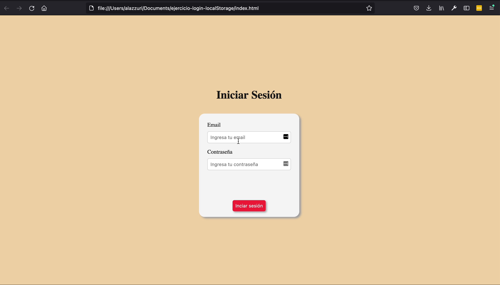

# Exercício Prático. ✏️

Neste exercício, vamos continuar a trabalhar no formulário de login que vimos anteriormente.

O objetivo do exercício é manter o utilizador logado, armazenando a informação da pessoa no localStorage uma vez que esta esteja logada: com base nesta informação, podemos então validar se a sessão foi registrada ou não, e com base nisso, decidir quais os elementos iremos mostrar à pessoa quando a página é carregada.

Por outro lado, teremos de dar à pessoa a possibilidade de sair, caso em que teremos de executar os passos necessários para limpar a informação armazenada e redirecioná-la de volta para o formulário de login.

Para resolver esta atividade, você terá de examinar e prestar atenção às diferentes tags html e às suas diferentes propriedades, para ver como pode selecionar e manipular cada elemento utilizando javascript. Da mesma forma, no arquivo ```styles.css```, deixamos-lhe alguns estilos que lhe podem ser úteis para realizar a tarefa atribuída. 👀 👀 👀

## Exemplo:

Veja o comportamento da aplicação na seguinte imagem (Modelo em Espanhol):



Bora programar! 💻
